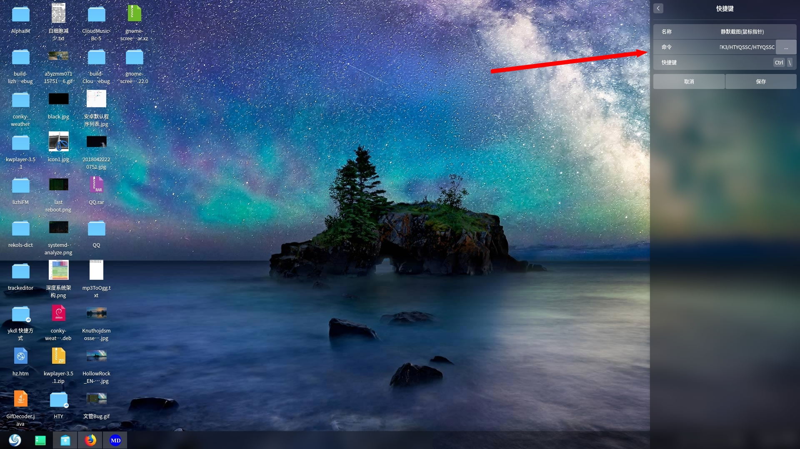

# GTK: 鼠标指针截图
Linux 平台基于 GTK+3 的带鼠标指针的截图程序，配合系统全局快捷键实现静默截图。   
64 位系统运行：HTYQSSC，其他自行编译。  
深度系统截图保存路径为主目录。  
### 编译命令
gcc -o "HTYQSSC" "HTYQSSC.c" `pkg-config --cflags --libs gtk+-3.0`  
  

### 参考
http://ftp.gnome.org/pub/gnome/sources/gnome-screenshot/3.22/